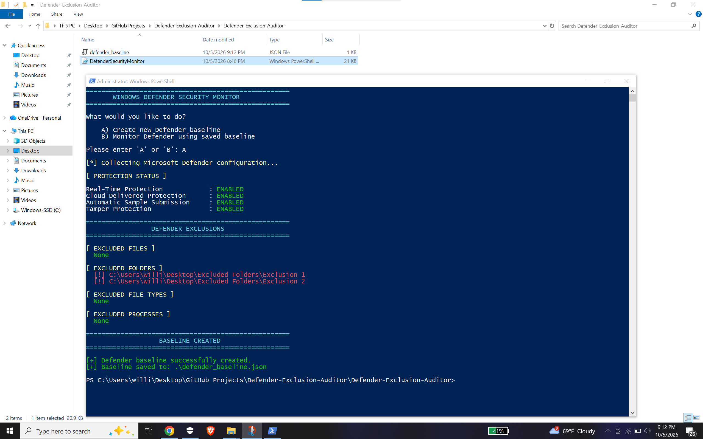
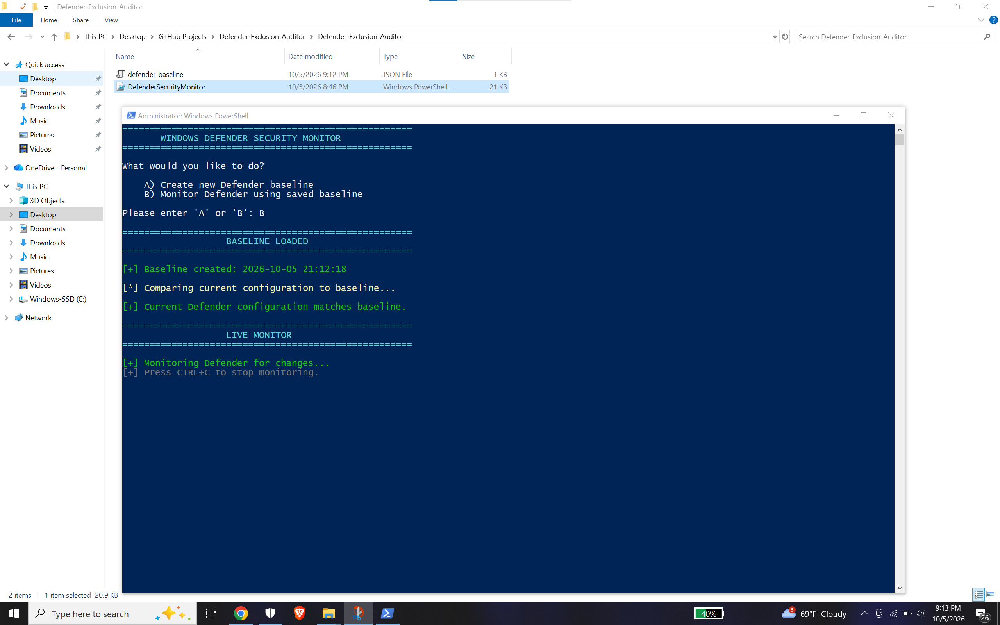
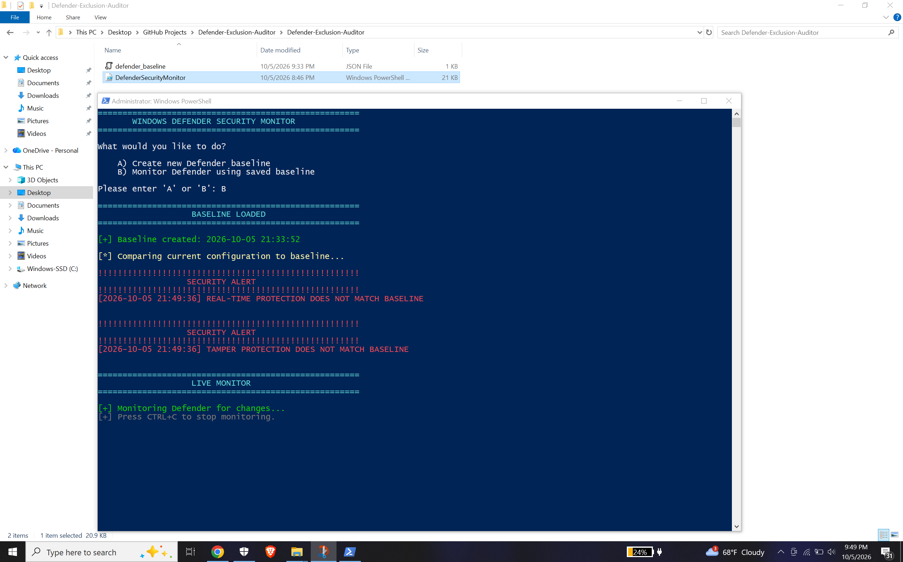

# Microsoft Defender Exclusion Auditor

PowerShell security monitoring tool that creates a trusted baseline of Microsoft Defender and continuously detects configuration changes.

It monitors:

- Real-Time Protection
- Cloud-Delivered Protection
- Automatic Sample Submission
- Tamper Protection
- File exclusions
- Folder exclusions
- File type exclusions
- Process exclusions

## Create a Baseline

Select **A** to capture the current Microsoft Defender configuration and save it to `defender_baseline.json`.



## Monitor Defender

Select **B** to compare the current configuration against the saved baseline and begin continuous monitoring.



If the current Defender configuration deviates from the trusted baseline, the monitor generates a security alert.



## Real-Time Detection Demo

Watch the monitor detect Microsoft Defender configuration changes and exclusions in real time.

[]([https://www.youtube.com/watch?v=VIDEO_ID](https://www.youtube.com/watch?v=DZkmz_VppfU))

## Run

Open **PowerShell as Administrator**:

```powershell
Set-ExecutionPolicy -Scope Process -ExecutionPolicy Bypass
.\DefenderSecurityMonitor.ps1
```

Then select:

```text
A) Create new Defender baseline
B) Monitor Defender using saved baseline
```

Press `Ctrl+C` to stop monitoring.

## Files

```text
Defender-Exclusion-Auditor/
├── DefenderSecurityMonitor.ps1
├── defender_baseline.json
├── README.md
└── screenshots/
    ├── create-baseline-powershell.png
    ├── normal-baseline.png
    └── baseline-deviation.png
```

> **Note:** `defender_baseline.json` represents the trusted Defender configuration and is not automatically overwritten while monitoring.

## Disclaimer

For defensive security, system administration, and authorized security testing only.
